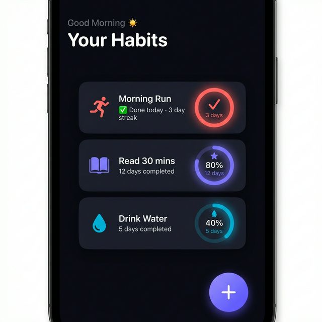
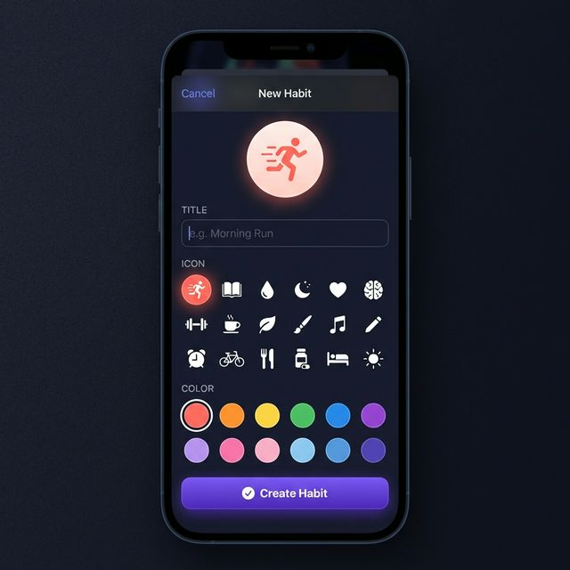
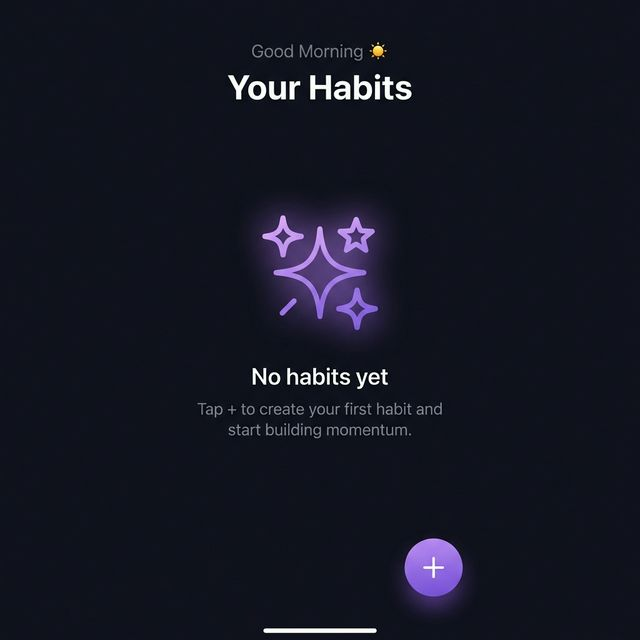

# Zenith — Habit Tracker

A modern iOS habit tracker built with **SwiftUI**, **SwiftData**, and **MVVM** architecture.

<p align="center">
  
  
  
</p>

## Features

- **Daily Check-ins** — Tap a habit card to toggle today's completion
- **Streak Tracking** — Automatic consecutive-day streak calculation
- **Monthly Progress Rings** — Animated circular progress based on current month
- **Icon & Colour Picker** — 18 SF Symbol icons and 12 curated colour swatches
- **Dark Theme** — Premium dark UI with gradient accents and glassmorphic cards

## Tech Stack

| Layer | Technology |
|---|---|
| **UI** | SwiftUI (iOS 17+) |
| **Persistence** | SwiftData (`@Model`, `@Relationship`) |
| **Architecture** | MVVM with `@Observable` macro |
| **Logging** | `os.Logger` (unified logging) |
| **Concurrency** | Swift Concurrency (`async/await`) |

## Project Structure

```
Zenith/
├── ZenithApp.swift            # App entry + SwiftData container
├── ContentView.swift          # Root NavigationStack
├── Models/
│   ├── Habit.swift            # @Model with cascade relationship
│   └── CheckIn.swift          # @Model for daily completions
├── ViewModels/
│   └── HabitViewModel.swift   # @Observable CRUD operations
├── Views/
│   ├── DashboardView.swift    # Main habit list + FAB
│   └── AddHabitSheet.swift    # Create habit form
├── Components/
│   ├── HabitCard.swift        # Habit card with progress ring
│   ├── CircularProgressView.swift  # Animated progress ring
│   └── ThemeButton.swift      # Gradient button + haptics
├── Extensions/
│   └── Color+Hex.swift        # Hex string → Color
└── Theme/
    └── AppTheme.swift         # Design tokens
```

## Requirements

- Xcode 16+
- iOS 17.0+
- Swift 5.9+

## Getting Started

1. Clone the repository
2. Open `Zenith.xcodeproj` in Xcode
3. Select a simulator (iPhone 17 Pro recommended)
4. Press **⌘R** to build and run

## License

MIT
